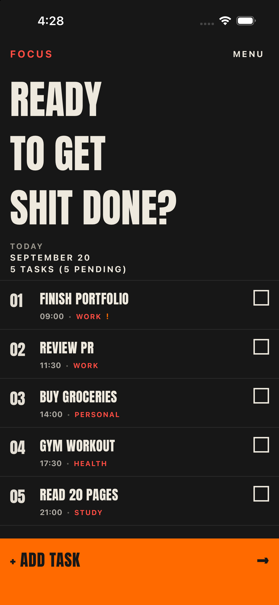
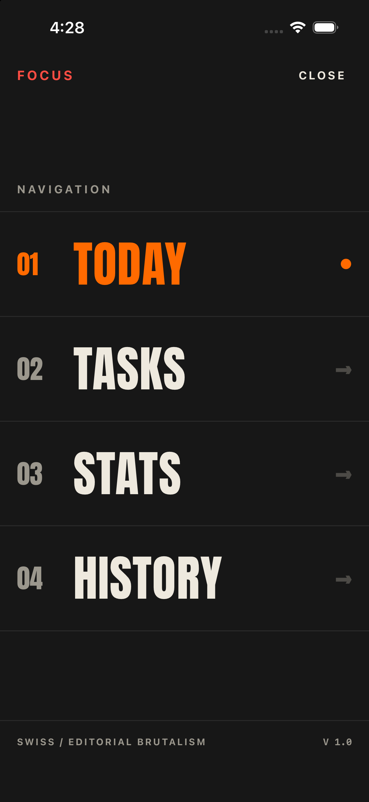
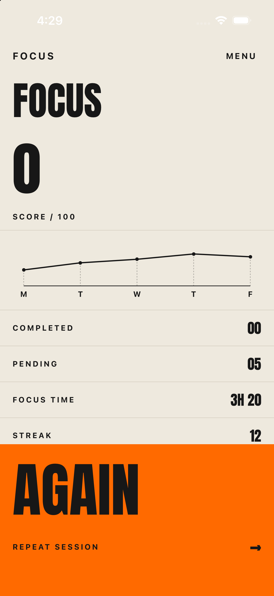
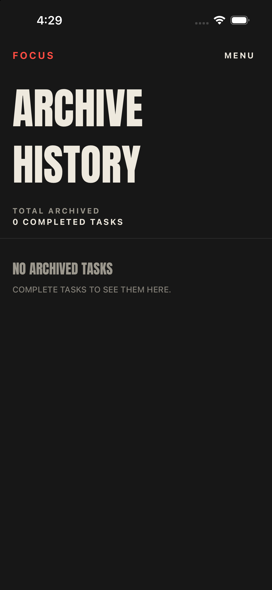

# FOCUS — Swiss Editorial Brutalist Todo List

A native iOS Todo List application designed with the visual language of **Swiss International Typographic Style** and **editorial brutalism**. Built with Swift, SwiftUI, and SwiftData for iOS 17+.

Typography-first, high contrast, minimalist but aggressive.

---

## Screen Gallery

<p align="center">
  
  
  
  
  
</p>

| 01 Today | 02 Navigation | 03 New Task | 04 Stats & Focus | 05 History |
| :---: | :---: | :---: | :---: | :---: |
| [`tasks.png`](tasks.png) | [`menu.png`](menu.png) | [`new task.png`](new%20task.png) | [`focus.png`](focus.png) | [`history.png`](history.png) |

---

## Design System

- **Typography**: Bundled open-source **Anton** display font for oversized editorial headlines, paired with monospaced and sans-serif metadata.
- **Palette**:
  - `Black`: `#171717` (Deep brutalist canvas)
  - `Paper`: `#EEE9DE` (Warm editorial newsprint)
  - `Orange`: `#FF6A00` (High-visibility action blocks)
  - `Red`: `#FF4D43` (Poster accents & wordmarks)
  - `Dark Red`: `#7F2019` (Add-task modal background)
  - `Muted Gray`: `#9B978D` (Hairlines & tertiary metadata)
- **Geometry**: Sharp 0pt corner radius across all cards, buttons, badges, and checkboxes.
- **Hairlines**: 1pt grid dividers separating numbered entries.
- **Haptics**: Tactile rigid, heavy, and notification feedback on interactions.

---

## Key Features

### 01. Today Focus ([`tasks.png`](tasks.png))
- Giant poster headline: `READY TO GET SHIT DONE?`
- Editorial date & pending counter metadata.
- Numbered items (`01`, `02`, `03`...) with brutalist square checkboxes.
- Dynamic strikethrough sweep animation and haptic feedback on completion.
- Full-bleed solid orange `+ ADD TASK →` bottom action bar.

### 02. Navigation Menu ([`menu.png`](menu.png))
- Full-screen typography drawer.
- Giant numbered screen destinations: `01 TODAY`, `02 TASKS`, `03 STATS`, `04 HISTORY`.
- Active screen indicator dot.

### 03. New Task Creator ([`new task.png`](new%20task.png))
- Deep maroon background with bright poster-red typography.
- Editorial borderless input fields.
- Brutalist category pills: `WORK`, `PERSONAL`, `HEALTH`, `STUDY`, `OTHER`.
- 3-level priority toggle: `LOW`, `MEDIUM`, `HIGH`.
- Time picker and optional notes.
- Bottom orange `CREATE TASK →` CTA.

### 04. Focus & Performance ([`focus.png`](focus.png))
- Warm paper cream background.
- Massive `FOCUS` score / 100.
- Minimalist trend line chart with vertical drop hairlines and weekday indicators.
- Metrics table: `COMPLETED`, `PENDING`, `FOCUS TIME`, `STREAK`.
- Solid orange `AGAIN` / `REPEAT SESSION →` section.

### 05. Archive History ([`history.png`](history.png))
- Complete record of completed tasks.
- Strikethrough typography and completion timestamps.
- One-tap `RESTORE` action.

---

## Responsive Layout

The layout uses container-based geometry metrics and safe area insetting:
- **iPhone SE (3rd generation)**: Compact typography and margins, flush bottom docking.
- **iPhone 16 / 16 Pro**: Native full-screen rendering with Dynamic Island integration; 5 task rows visible alongside the hero header on launch.
- **iPhone 16 Pro Max / 18 Pro**: Dynamic font scaling up to 84pt display typography.

---

## Tech Stack

- **Language**: Swift 6
- **UI Framework**: SwiftUI (iOS 17+)
- **Persistence**: SwiftData (`@Model TodoTask`)
- **Architecture**: MVVM
- **Dependencies**: None (Zero third-party packages)

---

## Getting Started

### Requirements
- Xcode 15.0+ (Xcode 16 recommended)
- macOS Sonoma or later
- iOS 17.0+ Simulator or device

### Run in Xcode
1. Open the project in Xcode:
   ```bash
   open TodoEditorial.xcodeproj
   ```
2. Select any iPhone simulator (e.g. iPhone 16, iPhone 16 Pro, or iPhone SE).
3. Press `Cmd + R` to build and run.

### Build via Command Line
```bash
xcodebuild -project TodoEditorial.xcodeproj -scheme TodoEditorial -destination "platform=iOS Simulator,name=iPhone 16" build
```
